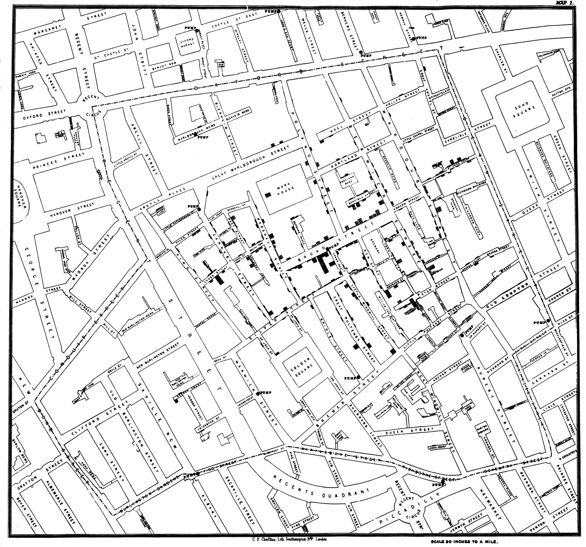
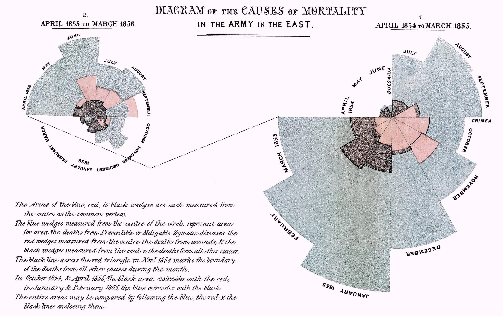

# Medios y Poder

## La realidad, aspiraciones

### John Snow - Mapa fantasma (1854)

### Florence Nightingale - Diagrama de las causas de mortalidad en la armada del Este (1858)

## Pseudourgencia

