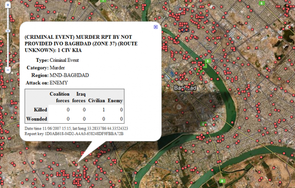
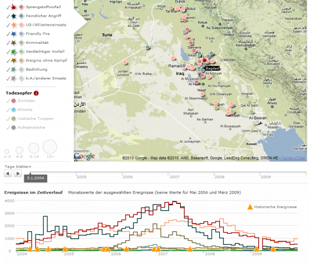
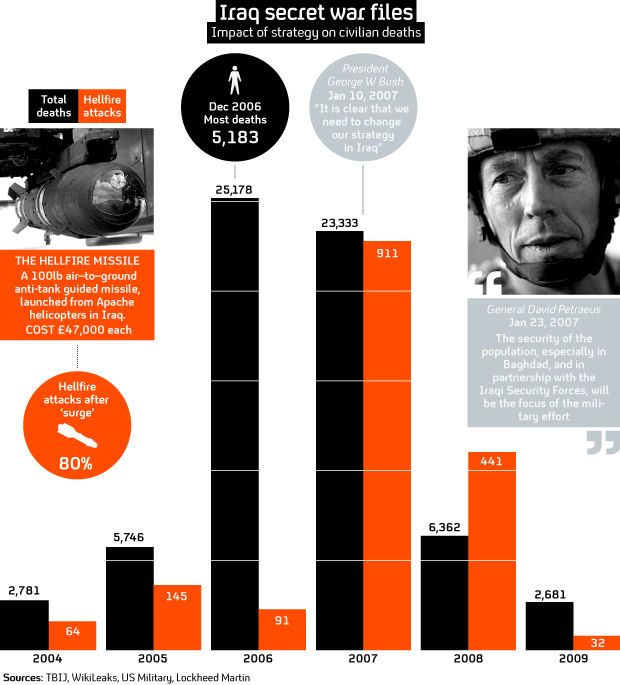
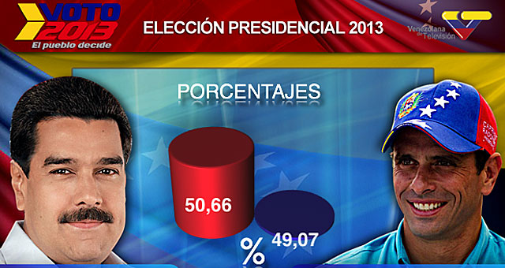
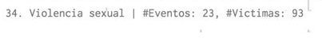
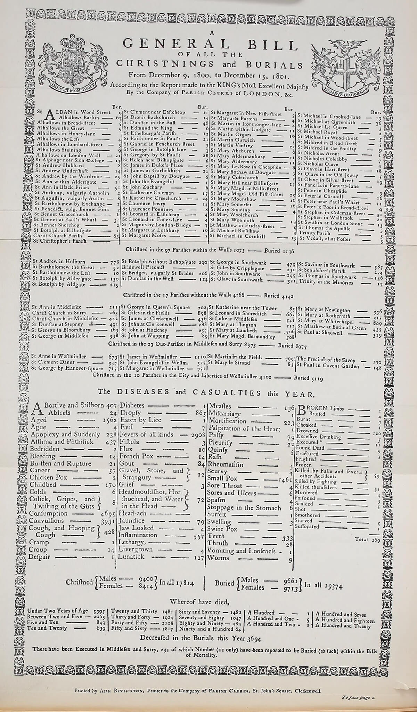
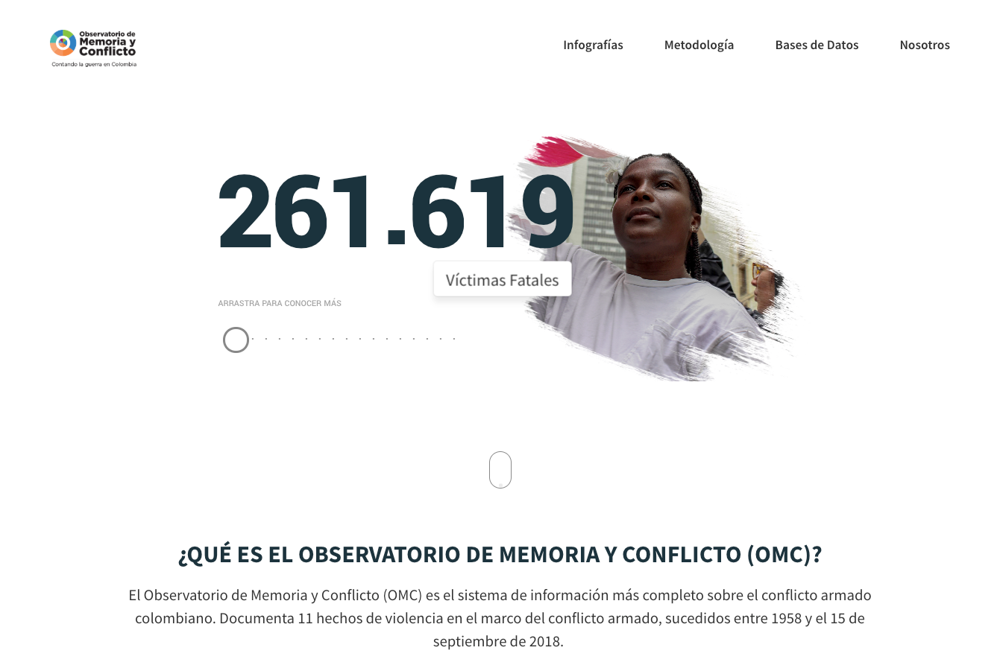

# Medios y Poder:

## La realidad revelada por los datos

### John Snow - Mapa fantasma (1854)

De la teoría de miasma liderada por William Farr a la de gérmenes por John Snow.

- Investigación cuantitativa con urgencia pública.
- Publicación técnica.
- Evidencia que permite el cambio de paradigma científico y política pública.

## John Tukey: El análisis de datos afirmativo vs. exploratorio

> El análisis de datos exploratorio es una actitud, un estado de flexibilidad, una apertura a investigar aquellas cosas que no sabemos que están allí, al tiempo que las que creemos que sí están. (Tukey, 1977, p. 806)

### Registros de la guerra en Iraq por Wikileaks (2010)

- La visualización permite primero explorar la base de datos, luego contar historias.
- Es un proceso iterativo, se pueden formular nuevas preguntas.

#### The Guardian

Mapa interactivo de todas las muertes.

#### Der Spiegel

Mapa interactivo con filtros y línea de tiempo histórica.

#### Channel 4

Infografía que resume los datos.

## Los datos son retóricos

> Datos significa - y a significado por mucho tiempo - aquello que es dado antes de un argumento. En consecuencia, el significado de los datos siempre debe cambiar con las estrategias argumentativas y el contexto - y con la historia de ambas. (Gitelman, 2013, p. 36)

> Los hechos son ontológicos, la evidencia es epistemológica, los datos son retóricos. Un dato puede ser un hecho, tanto como un hecho puede ser evidencia. Pero desde su formulación en el lenguaje, la existencia de un dato es independiente de cualquier consideración de corresponder a una verdad ontológica. Cuando un hecho es comprobado como falso, deja de ser un hecho. Datos falsos, al contrario, son datos en todo caso. (Gitelman, 2013, p. 18)

### Datos verídicos, hechos reales, evidencia falsa

### Datos de violencia sexual en Colombia durante el 2015 registrados por Monitor Humanitario UMAIC

#### Ejercicio: Describir estas cifras

## La retorica visual de los datos

### Florence Nightingale - Diagrama de las causas de mortalidad en la armada del Este (1858)

- Urgencia médica.
- Publicación en reporte.
- El tipo de lector es particular y se conocen sus modos de enfrentarse a los reportes.
- Visualización distorsionada para primero seducir y luego informar al lector puntual.
- El reporte que la acompaña persuade y aclara las distorsiones de la imagen.

### William Alfred - Diagrama de los barcos de esclavos (1788)

- Publicación en medios masivos.
- Denuncia pública.
- Movilización social.
- Apela a las emociones.
- ¿Manipulación? ¿se compromete la verdad?
- Estrategia que se replica en casos similares.

## Las bases de datos representan, el cuerpo queda austente

### Jacqueline Wernimont - Numbered Lives\_ Life and Death in Quantum Media (2019)

### Reporte de mortalidad de 1801

### Observatorio de memoria y Conflicto

## Pseudourgencia y los tiempos del pensamiento crítico / reflexivo

> Un análisis conceptual desapasionado de la tipología de la violencia debe por definición ignorar su impacto traumático. Aun así hay un sentido en el que un análisis frío de la violencia de algún modo reproduce y participa de su horror. Además hace falta una distinción entre verdad (factual) y veracidad: lo que hace del testimonio de una mujer violada (o de cualquier otra descripción de un trauma) algo veraz es su incoherencia factual, su confusión, su informalidad. Si la víctima fuese capaz de describir su dolorosa y humillante experiencia de manera clara, con todos los datos situados en un orden consistente, su claridad nos haría sospechar de su veracidad. (Žižek, 2009, p.12)

### Lideres Sociales asesinados en Colombia desde el 2016

[http://lideres-sociales.datasketch.co/](http://lideres-sociales.datasketch.co/)

- Publicación digital.
- Fenómeno en flujo, permanente actualización.
- Del macrocosmos de las visualizaciones a la singularidad de los relatos.
- Velocidad de actualización, los datos (y visualizaciones) se actualizan más rápido que los reportajes.

## Bibliografía

- Floridi, L. (2016). _The Routledge handbook of philosophy of information._ : New York : Routledge.
- Gitelman, L. (2013). _"Raw data" is an oxymoron_ : Cambridge, Massachusetts : The MIT Press.
- Kitchin, R. (2014). _The data revolution : big data, open data, data infrastructures & their consequences_: London : Sage Publications Ltd.
- Tukey, J. W. (1977). _Exploratory Data Analysis_ : Reading, Mass. : Addison-Wesley Pub. Co.
- Tukey, J. W. (1990). _Data-Based Graphics: Visual Display in the Decades to Come._ : Statistical Science(3), 327.
- Žižek S. (2009). _Sobre la Violencia: Seis reflexiones marginales_ : Buenos Aires, Argentina : Paidos.
